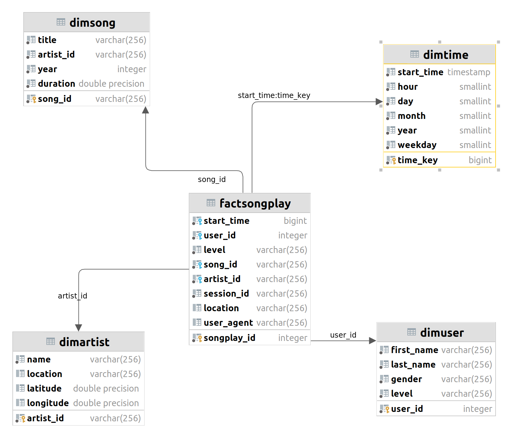

# Cloud Data Warehouse

## Project Description
A music streaming startup, Sparkify, has grown their user
base and song database and want to move their processes
and data onto the cloud. Their data resides in S3, in
a directory of JSON logs on user activity on the app,
as well as a directory with JSON metadata on the songs in their app.


The goal of the process is to build a cloud data warehouse by creating 
a ETL pipeline which extracts their data from S3, stages them in Redshift,
and transforms data into data warehouse
for their analytics team to find out insights in what songs their users are listening to.

## Data Modeling & ETL Pipeline
### Data Modeling


The above image is the data warehouse modeling following star schema, contains:
- Fact Table: **factSongPlay**
- 4 Dimension Tables: **dimSong**, **dimTime**, **dimArtist**, **dimUser**

### How to run
1. To run this project, you need to fill the information in `dwh.cfg` file
2. Install dependencies:
```angular2html
pip3 install boto3
pip3 install pandas
pip3 install psycopg2-binary
```
3. Setup needed infrastructure for this project:
- IAM role, VPC, Redshift cluster.
4. Run the below script to create staging tables and
analytics database.
```angular2html
python3 install create_tables.py
```
5. Finally, run the ETL pipeline to extract data in S3,
stage in redshift, and then transform and load into analytics database

### Project structure
* `dwh.cfg` config file contains credentials and database information
* `sql_queries.py` all sql queries for completing the project
* `create_tables.py` to create stagings table, fact and dimension tables
for analytic database
* `etl.py` to load data files in S3, stage in Redshift, and finally transform and
ingest into analytic database in Redshift

### ETL Pipeline
The ETL Pipeline contains 2 main steps:
1. Load data from S3 into staging tables on Redshift.
2. Transform and ingest data from staging tables into analytics tables on Redshift

