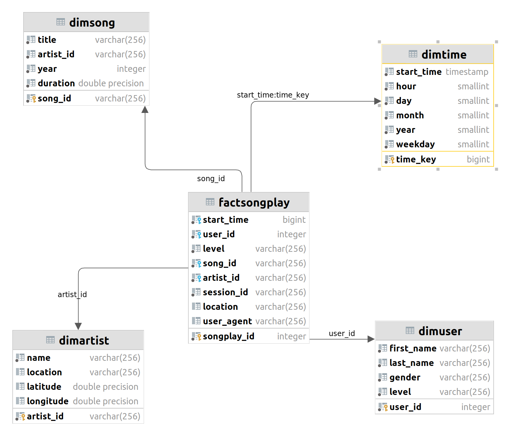

# Cloud Data Warehouse

## Project Description
A music streaming startup, Sparkify, has grown their user
base and song database and want to move their processes
and data onto the cloud. Their data resides in S3, in
a directory of JSON logs on user activity on the app,
as well as a directory with JSON metadata on the songs in their app.

The goal of the process is to build a cloud data warehouse by creating 
a ETL pipeline which extracts their data from S3, stages them in Redshift,
and transforms data into data warehouse
for their analytics team to find out insights in what songs their users are listening to.

## Data Modeling & ETL Pipeline
### Data Modeling

The above image is the data warehouse modeling following star schema, contains:
- Fact Table: **factSongPlay**
- 4 Dimension Tables: **dimSong**, **dimTime**, **dimArtist**, **dimUser**

### ETL Pipeline
The ETL Pipeline contains 2 main steps:
1. Load data from S3 into staging tables on Redshift.
2. Transform and ingest data from staging tables into analytics tables on Redshift